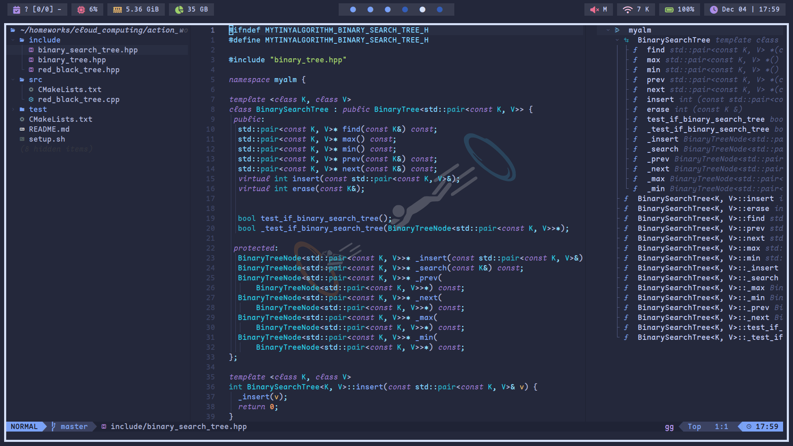

# My dotfiles on archlinux

Here are some details about my setup:

    WM : bspwm
    Shell : fish 
    Terminal : alacritty 
    Editor : lazyvim
    Panel : polybar
    Compositor : picom
    Notify Daemon : dunst
    Application Launcher : rofi
    File Manager : ranger
    Wallpaper Manager : feh

## preview

