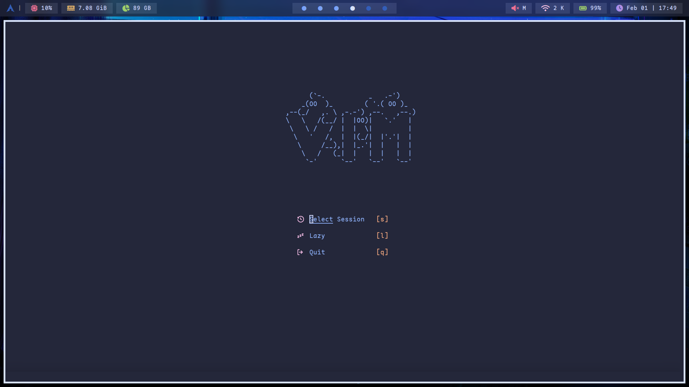
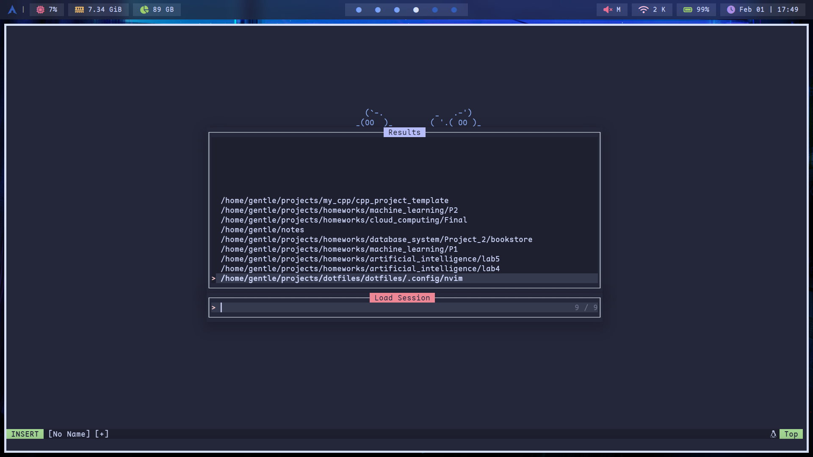
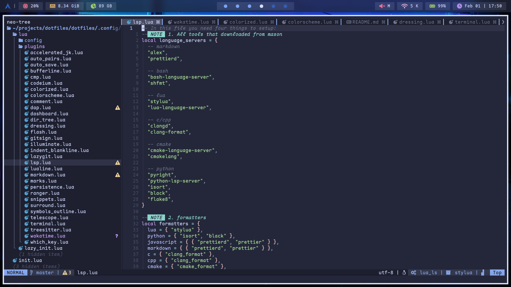
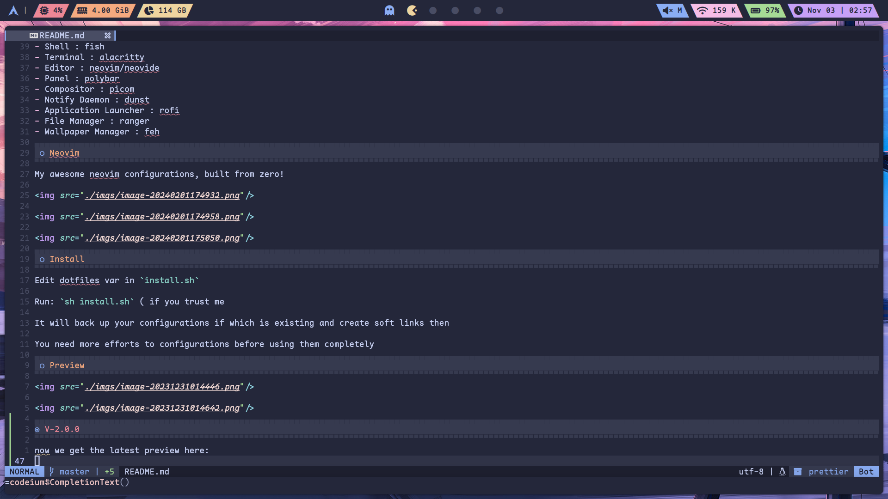
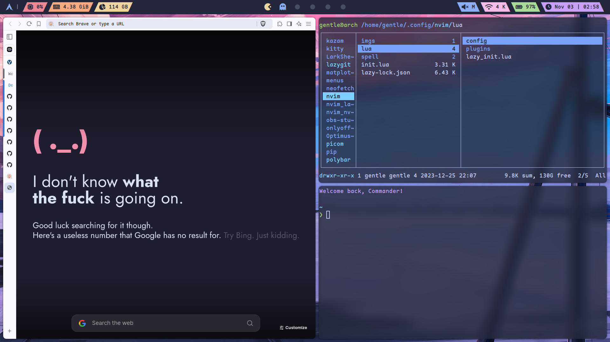

# My dotfiles on archlinux

> Real passion starts with linux 󰣐

Here are some details about my setup:

- WM : bspwm
- Shell : fish
- Terminal : alacritty
- Editor : neovim/neovide
- Panel : polybar
- Compositor : picom
- Notify Daemon : dunst
- Application Launcher : rofi
- File Manager : ranger/yazi
- Wallpaper Manager : feh

## Neovim

My awesome neovim configurations, built from zero!

## Install

Edit dotfiles var in `install.sh`

Run: `sh install.sh` ( if you trust me

It will back up your configurations if which is existing and create soft links then

You need more efforts to configurations before using them completely

## V-2.0.0

now we get the latest preview here:

    

    

## old preview

