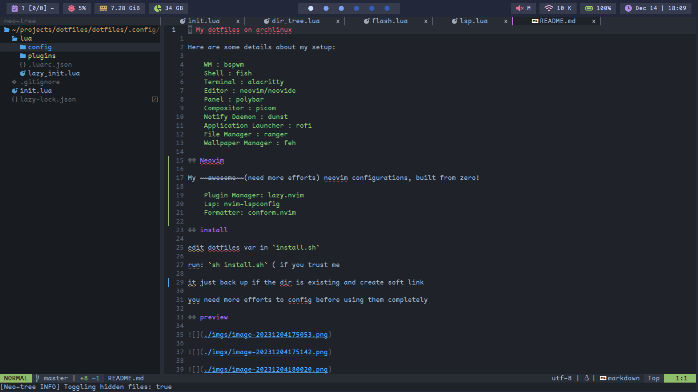
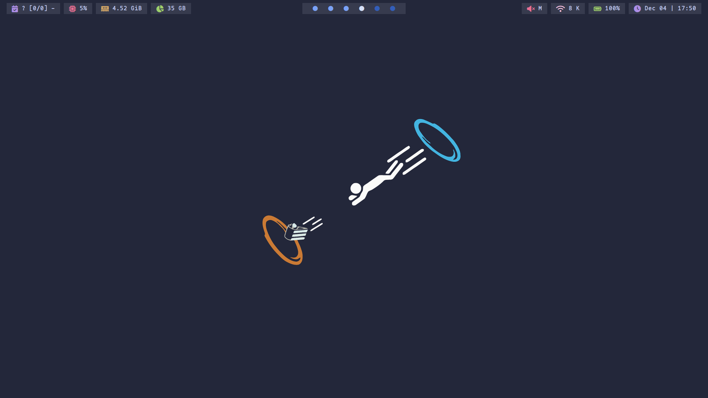
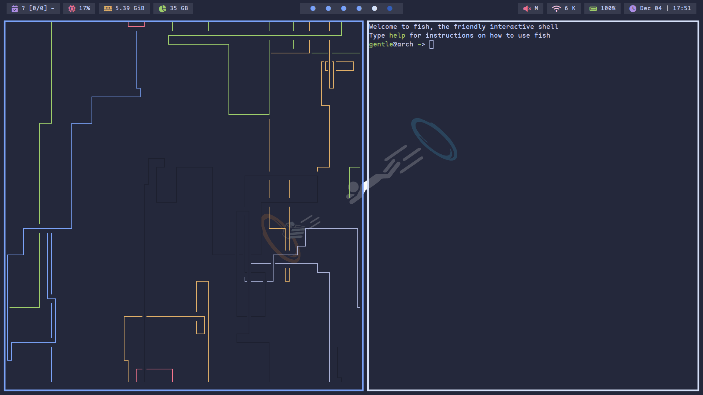

# My dotfiles on archlinux

Here are some details about my setup:

    WM : bspwm
    Shell : fish
    Terminal : alacritty
    Editor : neovim/neovide
    Panel : polybar
    Compositor : picom
    Notify Daemon : dunst
    Application Launcher : rofi
    File Manager : ranger
    Wallpaper Manager : feh

## Neovim

My ~~awesome~~(still need more efforts) neovim configurations, built from zero!

    Plugin Manager: lazy.nvim
    Lsp: nvim-lspconfig
    Formatter: conform.nvim

## install

Edit dotfiles var in `install.sh`

Run: `sh install.sh` ( if you trust me

It will back up your configurations if which is existing and create soft links then

You need more efforts to configurations before using them completely

## preview

